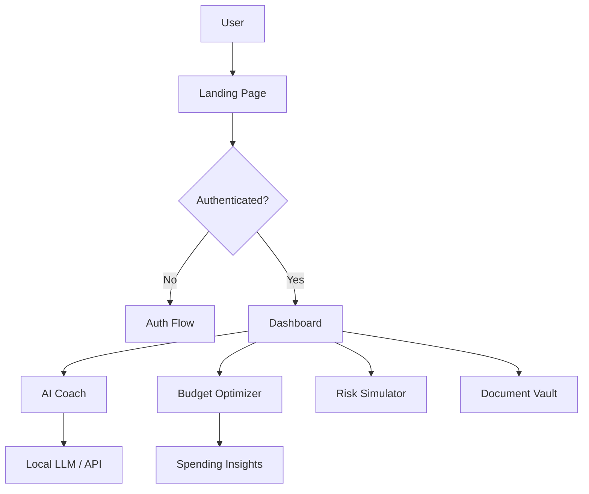

<div align="center">

  

  # 💸 Finexa
  ### Your AI-Powered Financial Stability Coach

  [](https://vitejs.dev/)
  [](https://reactjs.org/)
  [](https://tailwindcss.com/)
  [](https://opensource.org/licenses/MIT)

  **Empowering you to take control of your financial future with privacy-first AI analysis.**

  [Explore Dashboard](http://localhost:5173/dashboard) • [How It Works](http://localhost:5173/how-it-works) • [Pricing](http://localhost:5173/subscription)

</div>

<hr />

## ✨ Key Features

Finexa is designed to provide deep financial insights without compromising your data privacy.

| Feature | Description |
| :--- | :--- |
| **🤖 AI Financial Coach** | Personalized AI guidance to help you navigate complex financial decisions. |
| **📊 Smart Budgeting** | Automatically optimize your spending habits with AI-driven insights. |
| **📑 Document Analysis** | Upload and analyze your financial documents securely using local-first principles. |
| **🛡️ Risk Simulator** | Simulate various financial scenarios to prepare for emergencies or income changes. |
| **📈 Goals Tracker** | Set, track, and achieve your financial milestones with dynamic progress visualizations. |
| **🎓 Financial Education** | Learn the ropes of personal finance through curated interactive content. |

<hr />

## 🛠️ Tech Stack

Finexa leverages modern technologies to ensure a fast, secure, and delightful user experience.

- **Frontend Framework**: [React 18](https://reactjs.org/)
- **Build Tool**: [Vite](https://vitejs.dev/)
- **Styling**: [Tailwind CSS](https://tailwindcss.com/)
- **Animations**: [Framer Motion](https://www.framer.com/motion/)
- **Icons**: [Lucide React](https://lucide.dev/)
- **Charts**: [Recharts](https://recharts.org/)
- **State Management**: [Zustand](https://github.com/pmndrs/zustand)
- **API Client**: [Axios](https://axios-http.com/)

<hr />

## 🏗️ Architecture

Finexa follows a modern component-driven architecture with a focus on modularity and performance.



<hr />

## 🚀 Getting Started

To run Finexa locally, follow these simple steps:

### Prerequisites
- [Node.js](https://nodejs.org/) (v18 or higher)
- [npm](https://www.npmjs.com/) or [yarn](https://yarnpkg.com/)

### Installation

1. **Clone the repository**
   ```bash
   git clone https://github.com/atharva-404/Logic_Legion_Finexa.git
   cd Logic_Legion_Finexa
   ```

2. **Install dependencies**
   ```bash
   npm install
   ```

3. **Start the development server**
   ```bash
   npm run dev
   ```

4. **Open your browser**
   Navigate to [http://localhost:5173](http://localhost:5173) to see the app in action!

<hr />

## 🛡️ Privacy & Security

Finexa is built with a **Privacy-First** mindset. We believe your financial data belongs to you.
- **Local Data Storage**: Most of your data stays on your device.
- **Secure Analysis**: AI processing is done with encryption and anonymity in mind.
- **Transparent Open Source**: Our code is open for review and contributions.

<hr />

## 📄 License

Finexa is released under the [MIT License](LICENSE).

---

<div align="center">
  Made with ❤️ by the Logic Legion Team
</div>
