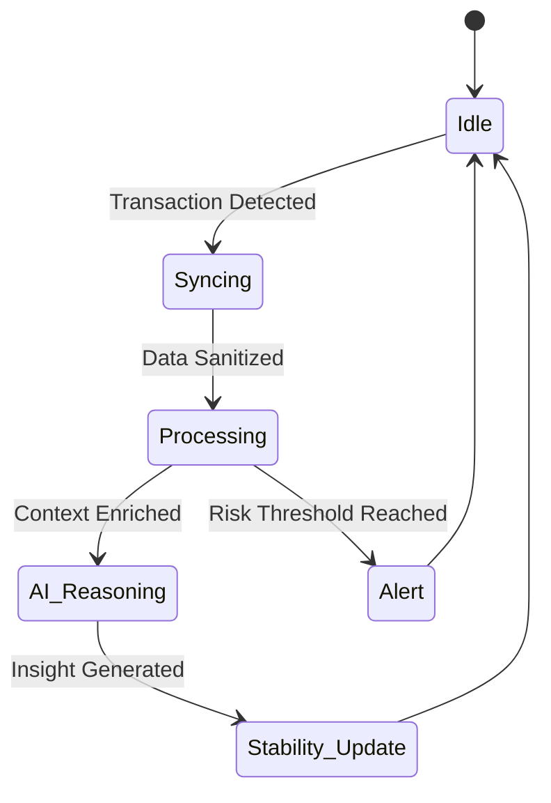

<div align="center">


# 🌌 Finexa: Infinite Stability
### *The Definitive AI Financial Intelligence Layer*

[](https://vitejs.dev/)
[](https://reactjs.org/)
[](https://x.com/)
[](https://opensource.org/licenses/MIT)

[**View Dashboard**](http://localhost:5173/dashboard) • [**Technical Specs**](#-technical-deep-dive) • [**Community**](#-community)

*Designed for those who demand absolute financial clarity. Built for the future.*

</div>

---

## 🎭 The Philosophy

**Finexa** is a masterclass in **Privacy-Preserving Intelligence**. We don't just track your money; we empower your intuition. By weaving together local-first AI, high-fidelity risk modeling, and a world-class design system, Finexa transforms raw data into a strategic asset.

---

## ⚡ Feature Matrix Elite

<table width="100%">
  <tr>
    <td width="50%" valign="top">
      <h3>🤖 AI Oracle v4.0</h3>
      <p>A multi-modal financial assistant capable of deep document reasoning and strategic debt restructuring simulations.</p>
      <ul>
        <li><b>Local-First:</b> Non-custodial AI processing.</li>
        <li><b>Actionable:</b> From insight to implementation in one click.</li>
      </ul>
    </td>
    <td width="50%" valign="top">
      <h3>🛡️ Risk Engine Prime</h3>
      <p>Monte Carlo simulations predicting 1,000+ financial trajectories based on global market volatility and personal habits.</p>
      <ul>
        <li><b>Stress Testing:</b> <i>"What if my income drops by 30%?"</i></li>
        <li><b>Safety Bounds:</b> Real-time liquidity alerts.</li>
      </ul>
    </td>
  </tr>
  <tr>
    <td width="50%" valign="top">
      <h3>💎 The Vault</h3>
      <p>Industrial-grade document management with local OCR and zero-knowledge categorization.</p>
      <ul>
        <li><b>Tax Ready:</b> Dynamic expense auditing.</li>
        <li><b>Secure:</b> End-to-end local encryption.</li>
      </ul>
    </td>
    <td width="50%" valign="top">
      <h3>📈 Pulse Health</h3>
      <p>A unified "Stability Index" derived from spending velocity, savings depth, and risk exposure.</p>
      <ul>
        <li><b>Dynamic:</b> Updates with every transaction.</li>
        <li><b>Predictive:</b> Forecasts 12-month stability.</li>
      </ul>
    </td>
  </tr>
</table>

---

## 🎨 Design System: "Obsidian Purple"

<div align="center">

| BG | Surface | Accent | Primary |
| :---: | :---: | :---: | :---: |
|  |  |  |  |
| `#05050f` | `#12103a` | `#c084fc` | `#a855f7` |

</div>

### 🖋️ Typography Specs
- **Header**: `Space Grotesk` (Geometric, Bold, 700)
- **Body**: `Inter` (Optimized for legibility, 400/500)
- **Mono**: `JetBrains Mono` (High-density data, 400)

---

## 🛠️ Technical Deep Dive

### High-Fidelity State Machine
Finexa uses a reactive state architecture to ensure data consistency across the AI and Dashboard layers.



### Stack Insights
- **Engine**: Vite (HMR-Optimized)
- **UI Logic**: React 18 + Zustand
- **Motion**: Framer Motion (60FPS Micro-interactions)
- **Analytical**: Recharts (Vector-based)

---

## � System Architecture

```text
📦 Logic_Legion_Finexa
 ┣ 📂 .agent               # Intelligence Configuration
 ┣ 📂 public              # High-Resolution Assets
 ┣ 📂 src
 ┃ ┣ 📂 components        # Atomic UI (Cards, Buttons, Glass)
 ┃ ┣ 📂 contexts          # Strategic State Providers
 ┃ ┣ 📂 lib               # Core Logic & Simulation Engines
 ┃ ┣ 📂 pages             # Route Definitions
 ┃ ┃ ┗ 📂 dashboard       # Feature Suites (AI Coach, Risk)
 ┃ ┣ 📂 store             # Zustand Global States
 ┃ ┣ 📜 App.tsx           # Application Entry Root
 ┃ ┗ 📜 main.tsx          # Execution Bootstrap
 ┣ 📜 tailwind.config.js  # Tokenized Design Specs
 ┗ 📜 vite.config.ts      # Optimized Infrastructure
```

---

## 🚀 Quantum Deployment

```bash
# Clone the singularity
git clone https://github.com/atharva-404/Logic_Legion_Finexa.git

# Initialize environment
npm install

# Launch hyper-local dev
npm run dev
```

---

## �️ Roadmap 2026-2027

- **Q4 2026**: Multi-node AI Sync (Encrypted cloud relay).
- **Q1 2027**: Predictive Tax Automation (Regional focus).
- **Q2 2027**: Wealth Circle Collaboration (Family governance).

---

<div align="center">

**Engineered with Passion by [Logic Legion](https://github.com/atharva-404)**

*"The best way to predict the future is to simulate it."*

</div>
